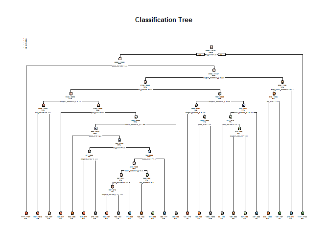

# PREDICTION ASSIGNMENT: QUANTIFYING PERFORMANCE OF EXERCISE
LAM CHOON HO  
15 APR 2017  


## TITLE: PREDICTION ASSIGNMENT: QUANTIFYING PERFORMANCE OF EXERCISE
AUTHOR: LAM CHOON HO
Date: 15 APR 2017

#### Executive Summary
The objective of this project is to quantifying performance of exercse with using prediction model on 20 different test cases. This project is used Random Forest machine learning technique 
for prediction task.

#### Background
Using devices such as Jawbone Up, Nike FuelBand, and Fitbit it is now possible to collect a large amount of data about personal activity relatively inexpensively. These type of devices are part of the quantified self movement - a group of enthusiasts who take measurements about themselves regularly to improve their health, to find patterns in their behavior, or because they are tech geeks. One thing that people regularly do is quantify how much of a particular activity they do, but they rarely quantify how well they do it. In this project, your goal will be to use data from accelerometers on the belt, forearm, arm, and dumbell of 6 participants. They were asked to perform barbell lifts correctly and incorrectly in 5 different ways. More information is available from the website here: http://groupware.les.inf.puc-rio.br/har (see the section on the Weight Lifting Exercise Dataset).

#### Citation
http://groupware.les.inf.puc-rio.br/har

#### 1. Loading necessary library
Loading necessary library for data reading and applying Decision Tree & Random Forest machine learning technique

```r
library(caret)
```

```
## Warning: package 'caret' was built under R version 3.3.3
```

```
## Loading required package: lattice
```

```
## Loading required package: ggplot2
```

```r
library(randomForest)
```

```
## Warning: package 'randomForest' was built under R version 3.3.3
```

```
## randomForest 4.6-12
```

```
## Type rfNews() to see new features/changes/bug fixes.
```

```
## 
## Attaching package: 'randomForest'
```

```
## The following object is masked from 'package:ggplot2':
## 
##     margin
```

```r
library(rpart)
```

```
## Warning: package 'rpart' was built under R version 3.3.3
```

```r
library(rpart.plot)
```

```
## Warning: package 'rpart.plot' was built under R version 3.3.3
```

#### 2. Retrieve Data
Getting the source of training data and testing data.

```r
pmlTrainingDataURL <- "https://d396qusza40orc.cloudfront.net/predmachlearn/pml-training.csv"
pmlTestingDataURL <- "https://d396qusza40orc.cloudfront.net/predmachlearn/pml-testing.csv"
```

#### 3. Preprocessing Data
Change empty value and invalid value to NA

```r
pmlTrainingData <- read.csv(url(pmlTrainingDataURL), na.strings=c("NA","#DIV/0!",""))
pmlTestingData <- read.csv(url(pmlTestingDataURL), na.strings=c("NA","#DIV/0!",""))
```

#### 4. Data Cleaning
Remove Near-Zero-Value (NZV), NA, Empty Value and first 6 columes

```r
NearZeroVal <- nzv(pmlTrainingData, saveMetrics = T)
CleanTrainingData <- pmlTrainingData[, names(pmlTrainingData)[!(NearZeroVal[, 4])]]
NAEmptyVal <- sapply(CleanTrainingData, function(x) !(any(is.na(x) | x == "")))
CleanTrainingData <- CleanTrainingData[, names(CleanTrainingData)[NAEmptyVal]]
CleanTrainingData <- CleanTrainingData[,-(1:6)]
```

#### 5. Segmented Data into Training Data and Test Data (Cross Validation Method)
Segregated to 70% training dataset and 30% testing dataset of cleaned training dataset

```r
TrainDataPart <- createDataPartition(y = CleanTrainingData$classe, p = 0.7, list = FALSE)
trainingDataSeg <- CleanTrainingData[TrainDataPart,]
testingDataSeg <- CleanTrainingData[-TrainDataPart,]
```

#### 6. Constructing Prediction Model with using Random Forest
Applying and train Random Forest machine learning technique to 70% training dataset

```r
PreModel <- randomForest(trainingDataSeg$classe ~. , data = trainingDataSeg)
```

#### 7. Prediction Model, Accuracy Rate and Out of Sample Error
According to the result, using Random Forest technique can give 99% accuracy rate. Thus,
this method is used to apply on the 20 different test cases.

Definition of Out of Sample Error
It is statistics speak which in most cases means "using past data to make forecasts of the future". "In sample" refers to the data that you have, and "out of sample" to the data you don't have but want to forecast or estimate.

**Decision Tree**

```r
DTTrainingMod <- rpart(classe ~ ., data=trainingDataSeg, method="class")
DTPredict <- predict(DTTrainingMod, testingDataSeg, type = "class")
rpart.plot(DTTrainingMod, main="Classification Tree", extra=102, under=TRUE, faclen=0)
```

<!-- -->

**Random Forest**

```r
ModelPrediction <- predict(PreModel, newdata = testingDataSeg)
print(confusionMatrix(ModelPrediction, testingDataSeg$classe))
```

```
## Confusion Matrix and Statistics
## 
##           Reference
## Prediction    A    B    C    D    E
##          A 1673    7    0    0    0
##          B    0 1130   11    0    0
##          C    0    2 1014   13    3
##          D    0    0    1  951    1
##          E    1    0    0    0 1078
## 
## Overall Statistics
##                                          
##                Accuracy : 0.9934         
##                  95% CI : (0.991, 0.9953)
##     No Information Rate : 0.2845         
##     P-Value [Acc > NIR] : < 2.2e-16      
##                                          
##                   Kappa : 0.9916         
##  Mcnemar's Test P-Value : NA             
## 
## Statistics by Class:
## 
##                      Class: A Class: B Class: C Class: D Class: E
## Sensitivity            0.9994   0.9921   0.9883   0.9865   0.9963
## Specificity            0.9983   0.9977   0.9963   0.9996   0.9998
## Pos Pred Value         0.9958   0.9904   0.9826   0.9979   0.9991
## Neg Pred Value         0.9998   0.9981   0.9975   0.9974   0.9992
## Prevalence             0.2845   0.1935   0.1743   0.1638   0.1839
## Detection Rate         0.2843   0.1920   0.1723   0.1616   0.1832
## Detection Prevalence   0.2855   0.1939   0.1754   0.1619   0.1833
## Balanced Accuracy      0.9989   0.9949   0.9923   0.9931   0.9980
```

**Conclusion:**
According to the result, using Random Forest technique can give 99% accuracy rate. However, the out sample of error (1 - Accuracy Rate) is shown 0.005%. Thus, Random forest is chooses.

#### 8. Applying Prediction Model to 20 cases
Below show the result of 20 different test cases

```r
print(predict(PreModel, newdata = pmlTestingData))
```

```
##  1  2  3  4  5  6  7  8  9 10 11 12 13 14 15 16 17 18 19 20 
##  B  A  B  A  A  E  D  B  A  A  B  C  B  A  E  E  A  B  B  B 
## Levels: A B C D E
```
